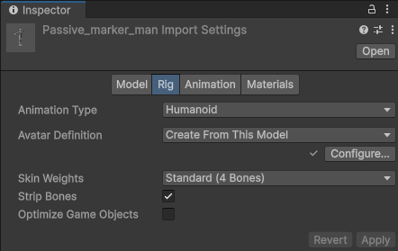

# Avatars

Like Videos?

<iframe title="vimeo-player" src="https://player.vimeo.com/video/1092647245?h=ea3dbe20f9" width="100%" style={{"aspect-ratio": "16 / 9"}} frameborder="0" allowfullscreen frameborder="0" allow="autoplay; fullscreen; picture-in-picture; clipboard-write"></iframe>

Here's a video tutorial on setting up an avatar in Hypernex

## Pre-requisites

Before starting, you need to actually have an avatar. There are plenty of resources to find avatars, even a simple search online will do. For our example, we'll be using a [mixamo](https://www.mixamo.com/) avatar, since a lot of the avatars on there are well rigged and Unity compatible (even allowing you to export FBX for Unity).

:::important IMPORTANT

After importing the avatar, make sure to set its rig type to *Humanoid*.

:::

After setting the rig type to humanoid, you can then move your avatar into the scene and continue to adding the information.

## Completing an Avatar Component

With your Avatar in the scene, now comes time to set up the Avatar component. Simply select the root GameObject of your Avatar and add an `Avatar` component to it. After adding it, you will be presented with various drop downs which are explained below.

### Viewposition and Speechposition

The Viewposition and Speechposition are Transform references which define where the avatar will look from and where the voice of a player will originate, respectively.

:::caution

The Viewposition and Speechposition Transforms should be children of the Head transform.

:::

### Eye Manager

The Eye Manager contains data for how the eyes should move. This can be controlled via. blendshapes or from the transform's rotations. You can also opt-in to use combined eye blendshapes if your avatar has one eye or if the eyes should be controlled with one driver.

### Visemes

Visemes control how your avatar's mouth moves when you are speaking in-game. They must be driven with blendshapes. When you add a SkinnedMeshRenderer, you can select the option to auto-select the blendshapes for the visemes to make the work a bit easier.

:::note

Always be sure to verify that the visemes match the blendshapes if you auto-select.

:::

### Custom Animators

Custom Animators load extra Animators that will run on top of the MainAnimator.

:::caution

The MainAnimator will **always** be overwritten by the client! You can test the Animator with the provided `CharacterController` bundled with the CCK.

:::

These animators can also have Override Animator Controllers.

### Local Avatar Scripts

Local Avatar Scripts allow you to expand your Avatar's capabilities by allowing you to make scriptable functions. There are multiple languages available to use, and all of these scripts run on the local client. There is no way to run avatar scripts in the server.

:::warning

Clients can deny assets from loading with the Component Security. You should practice fallbacks for if scripts or assets cannot be loaded.

:::

You can read more about scripting [here](../../engine-api/).

### Root Menu

The [AvatarMenu](./menu) which correlates to how users will interact with your Avatar Parameters in game.

### Avatar Parameters

The [AvatarParameters](./parameters) which list all parameters used in your Custom Animators.

Other Avatar-Related Components

LocalScript 

The LocalScript allows you to attach a script to be executed locally at runtime.

FaceTrackingDescriptor 

The FaceTrackingDescriptor component enables Facial Tracking on your avatar based on blendshapes that match VRCFaceTracking shapes.

## Finishing Up

Once you have correctly set all of your Avatar properties, you can move on to [uploading the asset](./../uploading)!