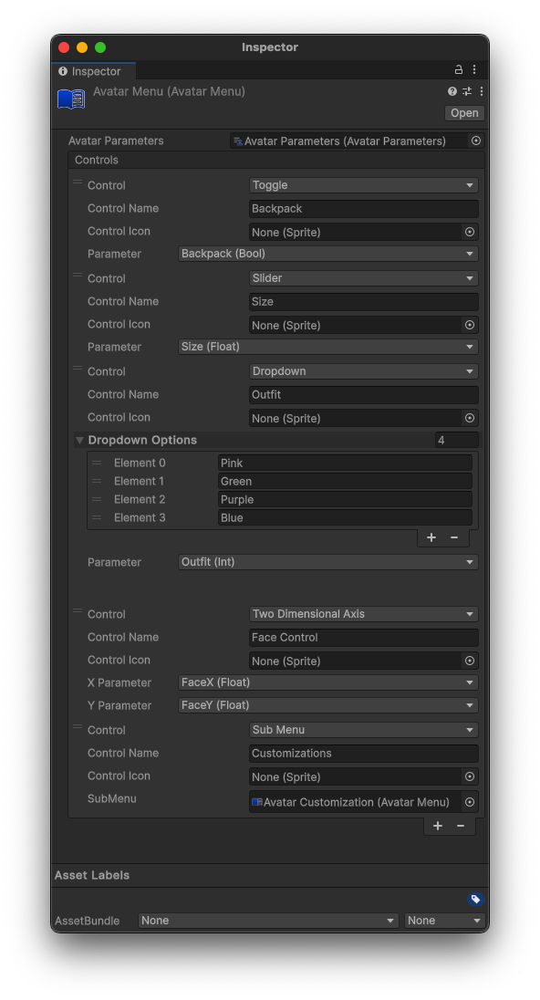

# Avatar Menu

The AvatarMenu allows users to design interactive controls for parameters on your Avatar.

## Creating a Menu

To create a Menu, simply right click anywhere in your Project folder, then select `Create > Hypernex > Avatars > Menu`, and you will see your newly created Avatar Menu. After you create a Menu, you will need to reference your [Avatar Parameters](./parameters.md) otherwise the Menu will not work correctly.

## Create a Control

To create a control, you can simply click the `+` at the bottom of the window. From there you can configure your control.

All controls let you configure the following:

+ Control Name
  + The name of the Control
+ Control Icon *(Optional)*
  + An Icon to appear on the control in the in-game UI

### Creating a Toggle

Set your Control to a `Toggle` and then attach a parameter. Preferably, your parameter should be a bool.

### Creating a Slider

Set your Control to a `Slider` and then attach a parameter. Preferably, your parameter should be a float. This control will range from `-1` to `1`.

### Creating a Dropdown

Set your Control to a `Dropdown` and attach a parameter. Preferably, your parameter should be an int. This control will respect greater than 0 and less than the length of your Dropdown Options.

To create options, simply expand the `Dropdown Options` and create an entry for each possible option. Each option is represented as an integer at the index of the option (starting from 0).

### Creating a 2D Axis

Set your Control to a `Two Dimensional Axis` and attach an x and y parameter. Preferably, both parameters should be a float. Both parameters will range from `-1` to `1`.

### Creating a SubMenu

First, create a new Menu and set it up how you want. Then, set your Control to `Sub Menu` and reference your other SubMenu under the control.