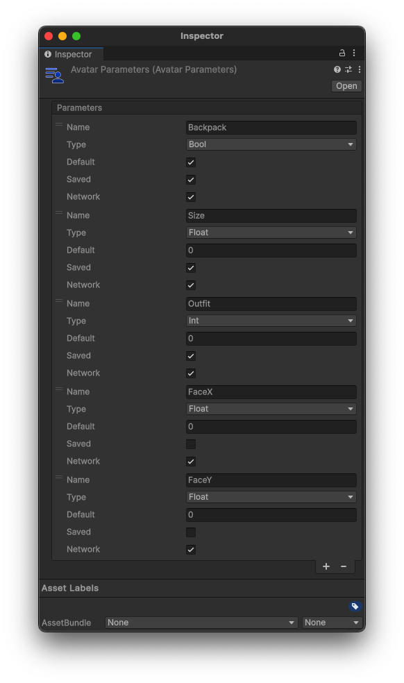

# Avatar Parameters

The AvatarParameters allow a user to create Parameters to interact with their Avatar's Custom Animators.

## Creating a Parameters Sheet

To create a Parameters Sheet, right click anywhere in your Project folder, then select `Create > Hypernex > Avatars > Parameters`, and you will see your newly created Avatar Parameters Sheet.

## Create a Parameter

To create a parameter, click the `+` button at the bottom of the window. From there you can configure your parameter.

## Parameter Options

### Name

The name of the parameter that your Animators contain.

:::caution

The parameter name is case-sensitive!

:::

### Type

The type of Parameter. Can be any of the following:

+ Bool
  + `true` or `false`
+ Float
  + Floating point number
+ Int
  + Whole number/Integer

### Default

The default value of the parameter. This will match your selected type.

### Saved

If the parameter should be saved when creating a profile.

### Network

Whether or not to sync the parameter over the network.

:::tip

Try to reduce the number of Networked parameters, as having too many may degrade your experience!

:::