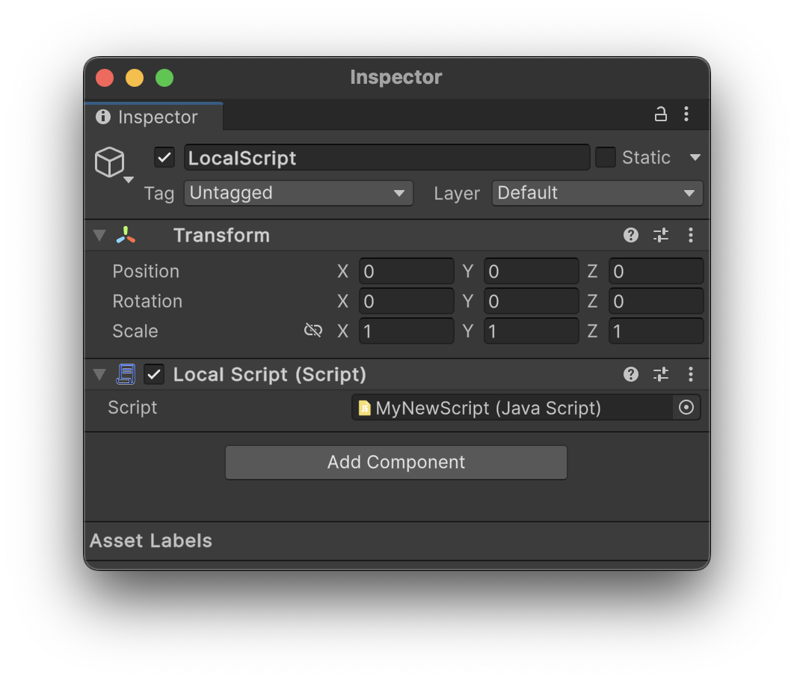

# Local Scripts

The new LocalScript component is used by both Worlds and Avatars to load and execute client code during runtime.

## The ModuleScript

A ModuleScript is a script that is created by Hypernex used specifically for sandboxing. The Hypernex CCK will automatically serialize all `*.js` and `*.lua` files as ModuleScripts and they should have special icons when imported in your Project view.

However, if you'd like to create a new ModuleScript, that is very easy to do.

### Creating a JavaScript File

Simply right click anywhere in your Project view and select `Create > Hypernex > Scripts > JavaScript File`.

### Creating a Lua File

Simply right click anywhere in your Project view and select `Create > Hypernex > Scripts > Lua File`.

### Editing the ModuleScript

To edit the ModuleScript, simply double-click the ModuleScript in your Project view, and it will open in your system's default text editor. You may also right click the file, open its location, and open it in any other desired text editor.

## Creating a LocalScript

To create a LocalScript, simply select any GameObject and select `Add Component`. In the list of options, search for `LocalScript` and add Hypernex's LocalScript component. Once you create a LocalScript, simply reference the required ModuleScript field (see above).

:::note

If your asset is an Avatar, then your LocalScript component must be attached to a descendant of your Avatar.

:::

## Working with Scripts

To learn more about scripting and available APIs, check out the [Engine API](./../../engine-api/) documentation!