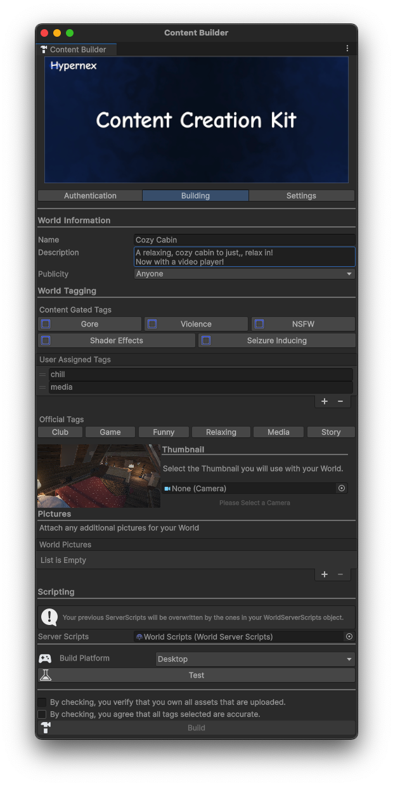

# Uploading

Uploading assets are the most important part to getting your avatar in the game.

## Selecting an Asset

There are two different ways on how to select the asset depending on if the asset is an avatar or a world.

### World

Congrats! You're already done. You don't have to select anything!

### Avatar

Select Content Window | Select Avatar Window 
---|---
 | 

In the list of avatars, select your Avatar's GameObject name.

## Filling in Data

On the next screen, you will be asked to fill in the following information.

**Name** - The name of the asset

**Description** - The description of the asset

**Publicity** - Defines who can access the asset

**Tags** - Any searchable tags for the avatar

**Thumbnail** - The thumbnail for the asset

**World Pictures (Worlds Only)** - Any extra icons for the world

**Server Scripts (Worlds Only)** - Any scripts that will run on the server-side.

## Selecting a Build Target

:::caution

While Android is currently paused for the Unity client, it is still good practice to build and upload for Android.

:::

Simply drop down the `Build Platform` and select `Mobile`. After doing this, your solution should refresh to target Android.

## Building

Click the `Build` button and off you go! Grab some popcorn, because it may take some time for your asset to build, especially if it's your first time!