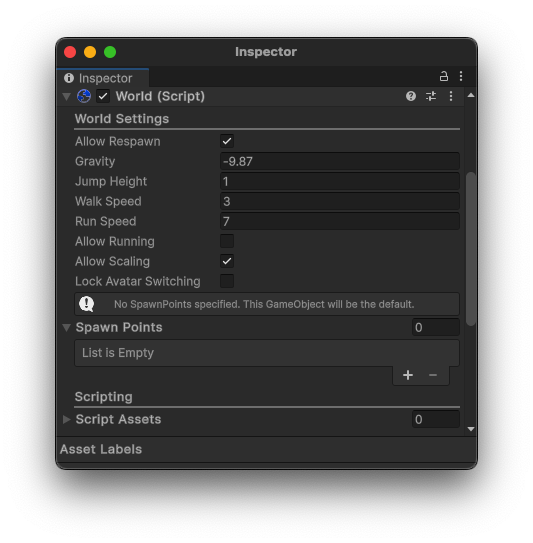

# Worlds

Like Videos?

<iframe title="vimeo-player" src="https://player.vimeo.com/video/1092646595?h=f1b0e7768d" width="100%" style={{"aspect-ratio": "16 / 9"}} frameborder="0" allowfullscreen frameborder="0" allow="autoplay; fullscreen; picture-in-picture; clipboard-write"></iframe>

Here's a video tutorial on setting up a world in Hypernex

## Setting Up

When starting, create a new GameObject in the scene you have the world in. After creating that GameObject, go ahead and add a `World` component to it.

:::tip

You can also create a World object by opening the Content Builder Window and selecting `Create a World Object!`.

:::

The World component describes all the information about the world and the current scene.

## Configuring the World Component

The World component has plenty of various options and configurations to ensure your world has the correct 'feel' to it.

Below are the explanations to all of the properties in the World component.

**Allow Respawn** - Defines if a user is allowed to respawn from their menu

**Allow Running** - Defines if a user is allowed to run

**Allow Avatar Scaling** - Allows a user to scale their avatar

**Lock Avatar Switching** - Sets if a user is allowed to switch avatars

**Walk Speed** - The normal walk speed

**Run Speed** - The normal run speed

**Jump Height** - How high the player jumps

**Gravity** - The direction of the gravity

**Spawn Points** - A list of GameObjects that are used as spawn locations

**Script Assets** - A list of Unity Objects than can be accessed by LocalScripts

Other World-Related Components

LocalScript 

The LocalScript allows you to attach a script to be executed locally at runtime.

RespawnableDescriptor 

The RespawnableDescriptor describes how much lower a Rigidbody needs to be below the lowest point in a world before it is respawned.

NetworkSyncDescriptor 

The NetworkSyncDescriptor describes all of the properties of a GameObject that should be synced across the network.

GrabbableDescriptor 

The GrabbableDescriptor describes how a GameObject can be grabbed and moved in-game.

VideoPlayerDescriptor 

:::note

There is a VideoPlayer prefab available [here](https://github.com/TigersUniverse/Hypernex.Unity.Gizmos/tree/main/Hypernex.VideoPlayer)

:::

The VideoPlayerDescriptor defines properties for IVideoPlayers to work off of.

## Finishing Up

Once you have completed your World component, you should be able to see it appear in your CCK Builder window. From here you can continue to [upload the world](./../uploading.md).