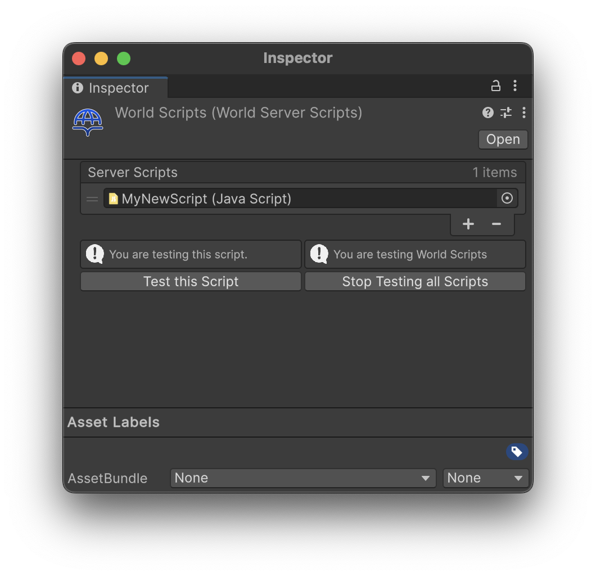

# Server Scripts

The WorldServerScripts component contains all of your scripts that you will upload to the server when building your world. These scripts run specifically on the Game Servers and have full authority. These scripts also cannot be downloaded by the client, so they are much safer for storing sensitive information.

:::danger

The domain you play Hypernex on may allow clients to download server scripts if GameServer authentication is disabled. Please contact the respective server administrators if you have any concerns!

:::

## Marking a ModuleScript as a Server Script

To have a ModuleScript be uploaded as a Server Script, simply add a new entry in your WorldServerScript's Server Scripts list, then drag and drop the ModuleScript into the new spot.

## Uploading ServerScripts with your World

When you go to upload your world, at the bottom of the Content Builder, select your WorldServerScripts component in the Server Scripts field. Whenever you Build, the previous ServerScripts will be removed and replaced with the current ones.

:::note

+ If the Server Scripts field is empty, nothing will happen to the current Server Scripts. If the WorldServerScript's Server Scripts list is empty, then all Server Scripts will be removed from your world.
+ Server Scripts are **NOT** platform dependent. You can update them simply by Updating your World.

:::